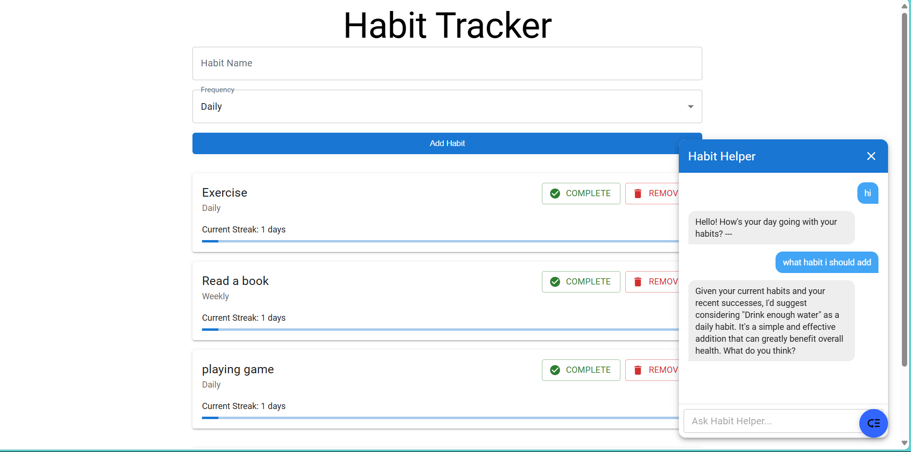

# Habit Tracker with Redux & Local AI (llama.cpp + Mistral 7B)

This project integrates a feature-rich habit-tracking web application built with **React, Redux, and Material UI** with a powerful, locally-run AI assistant. The AI is powered by **[`llama.cpp`](https://github.com/ggerganov/llama.cpp)**, running the **Mistral 7B Instruct v0.2 (Q4_K_M GGUF)** model locally. Communication between the frontend and the AI server happens via a local HTTP API.

The AI assistant can help users analyze their habit history, provide motivation, suggest new habits, and explain how to build them effectively.

---

## ✨ Features

*   **Habit Management:** Add, track, and remove daily or weekly habits.
*   **Streak Tracking:** Monitor your current streak for each habit.
*   **Habit Statistics:** View overall progress, including total habits, habits completed today, and the longest streak.
*   **Local AI Coach (Habit Helper):**
    *   Chat interface to interact with the AI.
    *   Personalized advice based on your current habits and progress.
    *   Suggestions for new habits tailored to your goals (e.g., stress reduction, productivity).
    *   Ability for the AI to directly offer to add new habits to your list, confirmable with a click.
*   **Offline First:** The entire application, including the AI, runs locally on your machine. No internet connection is required after initial setup.
*   **Privacy Focused:** All your habit data and AI interactions remain on your local machine.

---
## 📸 Demo Screenshot



---
## 🛠️ Tech Stack

*   **Frontend:**
    *   React
    *   Redux Toolkit (for state management)
    *   Material UI (for UI components)
    *   TypeScript
*   **Local AI Backend:**
    *   llama.cpp
    *   Mistral 7B Instruct v0.2 (Q4_K_M GGUF model)
*   **Development:**
    *   Vite (for frontend bundling and development server)

---

## 🚀 How to Run

### Prerequisites

1.  **Node.js and npm:** Ensure you have Node.js (which includes npm) installed. You can download it from [nodejs.org](https://nodejs.org/).
2.  **llama.cpp:** You need to have `llama.cpp` [cloned and built](https://github.com/ggerganov/llama.cpp#build) on your system. This project assumes you have built `llama.cpp` using CMake and MSVC (on Windows), resulting in `llama-server.exe`.
3.  **LLM Model:** Download the `mistral-7b-instruct-v0.2-q4_k_m.gguf` model (or a similar GGUF model). You can find GGUF models on [Hugging Face](https://huggingface.co/TheBloke/Mistral-7B-Instruct-v0.2-GGUF).

### 1. Prepare Model & LLaMA.cpp Directory

Ensure your directory structure for `llama.cpp` and the model is as follows (relative to your project's root or a known location):

```
your_workspace/
├── llama.cpp/                   # Cloned llama.cpp repository
│   ├── models/                  # Create this folder if it doesn't exist
│   │   └── mistral-7b-instruct-v0.2-q4_k_m.gguf  # Place your downloaded model here
│   ├── build/                   # Build directory for llama.cpp
│   │   └── bin/Release/         # Contains llama-server.exe (path may vary based on build)
│   └── ...                      # Other llama.cpp files
└── habit_tracker_redux_ex/      # This project's frontend code
    └── ...
```

> **Important:** The command below assumes `llama-server.exe` is in `llama.cpp\build\bin\Release\` and the model is in `llama.cpp\models\`. Adjust paths if your setup differs.

### 2. Start the LLaMA.cpp Server

Open a terminal, navigate to your `llama.cpp\build` directory, and run:

```bash
# Navigate to your llama.cpp build directory
# Example: cd path/to/your_workspace/llama.cpp/build

# Run the server (Windows example)
./bin/Release/llama-server.exe -m ../models/mistral-7b-instruct-v0.2-q4_k_m.gguf -c 2048 --port 8080 --host 0.0.0.0
```

*   `-m ../models/mistral-7b-instruct-v0.2-q4_k_m.gguf`: Path to the GGUF model file.
*   `-c 2048`: Context window size.
*   `--port 8080`: Port for the HTTP server.
*   `--host 0.0.0.0`: Makes the server accessible from any IP on your machine (useful if the frontend runs in a different network context, though `localhost` is usually sufficient for local dev).

> Leave this terminal window open. The LLaMA server needs to keep running.

---

### 3. Run the Redux Habit Tracker Frontend

Open a **new terminal window**, navigate to the `habit_tracker_redux_ex` directory (this project's root), and run:

```bash
# Navigate to the frontend project directory
# Example: cd path/to/your_workspace/habit_tracker_redux_ex

# Install dependencies (only needed once)
npm install

# Start the development server
npm run dev
```

The application should now be available in your web browser at: **[http://localhost:5173](http://localhost:5173)** (or a different port if 5173 is in use - check the terminal output from `npm run dev`).

---

## 🧩 Notes & Troubleshooting

*   **Communication:** The frontend (React app) interacts with the local LLaMA server via HTTP requests to `http://localhost:8080/completion`.
*   **Performance:** Running a 7B model on CPU can be demanding. Performance will vary based on your CPU (Intel i5 Gen 12 or better recommended for a decent experience with Q4_K_M). Ensure you have sufficient RAM (16GB+ recommended).
*   **Model Path:** Double-check the path to your `.gguf` model file in the `llama-server.exe` command.
*   **CORS:** The `llama-server.exe` usually handles Cross-Origin Resource Sharing (CORS) requests correctly for local development. If you encounter CORS issues, ensure your browser or firewall isn't blocking requests.
*   **Firewall:** If you have a strict firewall, you might need to allow connections to port `8080` on `localhost`.

---

## 📁 Project Structure Overview

```
your_workspace/
├── llama.cpp/                   # LLaMA.cpp source, build, and models
│   ├── models/
│   │   └── mistral-7b-instruct-v0.2-q4_k_m.gguf
│   └── build/
│       └── bin/Release/
│           └── llama-server.exe
└── habit_tracker_redux_ex/      # React + Redux frontend application (this project)
    ├── public/                  # Static assets
    ├── src/                     # Main source code for the frontend
    │   ├── components/          # UI Components (ChatbotUI, AddHabitForm, HabitList, HabitStats)
    │   ├── store/               # Redux store configuration and slices (habitSlice)
    │   └── utils/               # Utility functions (habitUtils)
    ├── .eslintrc.cjs
    ├── .gitignore
    ├── index.html
    ├── package-lock.json
    ├── package.json
    ├── README.md                # This file
    ├── tsconfig.json
    ├── tsconfig.node.json
    └── vite.config.ts
```

---

## 🔮 Future Enhancements (Ideas)

*   Implement streaming responses from LLaMA.cpp for a more interactive chat experience.
*   Persist habit data and chat history to `localStorage` using `redux-persist`.
*   Allow users to select different local models or adjust AI parameters from the UI.
*   More advanced AI-driven analytics, such as identifying patterns in missed habits or suggesting optimal times.
*   Improved UI/UX for the chat interface, including markdown rendering for bot responses.
*   Add unit and integration tests.

---

Happy Habit Tracking and AI Experimenting! 🚀
```
